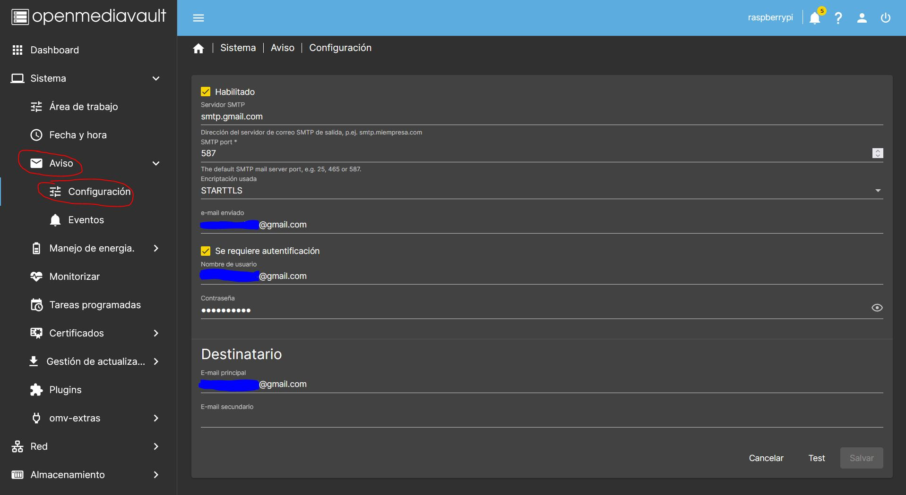

# Configuración de Open Media Vault

Una de las partes más importantes de tu nuevo NAS es dejarlo bien configurado para tener todo controlado y estar enterado de todos los posibles problemas que puedas tener, por ejemplo para saber si tus discos están en buen estado, si el backup se ha realizado correctamente. También aprenderás a compartir carpetas, dejarlas accesibles a quien tu quieras, montar unidades remotas, configurar backups y muchas otras cosas más.

## Configuración de las notificaciones

¿Quieres estar enterado de todo?, ¿se ha hecho bien el backup?, hay algún problema con el equipo, es hora de configurar tus notificaciones.

### Crear una cuenta de correo

Si quieres estar avisado en todo momento, la mejor de hacerlo es a través de un correo, te recomendamos que uses una cuenta de correo específicamente para esta tarea, ideal en google, ¿a que esperar para crearte una?

Para ello ve a tu página de administracion de OMV y seleccionas *Sistema > Aviso > Configuración* y completas los siguientes datos:
 
 * Marcas la casilla de *Habilitado*
 * *Servidor smtp:* smtp.gmail.com
 * *SMTP port:* 587
 * *Encriptación:* STARTTLS
 * *e-mail enviado:* tu email
 * Marcas la casilla *Se requiere autentificación*
 * *Contraseña:* tu contraseña del correo
 * *e-mail principal:* tu correo

Una vez completados todos los datos, le das al botón *Salvar*, y una vez grabado puedes usar el botón *Test*, para saber si funciona.  

<figure markdown> 
  { width="1000" }
  <figcaption>Configuración del correo para los avisos</figcaption>
</figure>