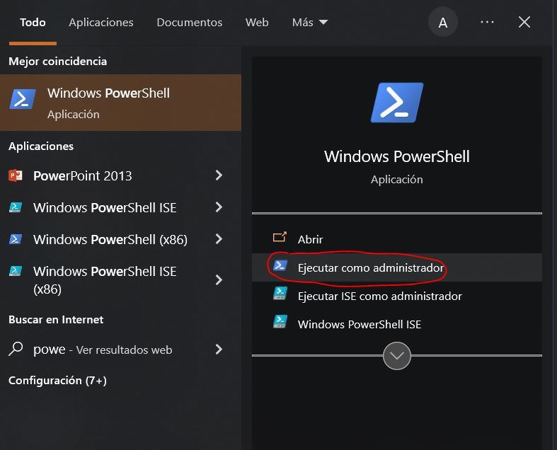

# Configurar Windows como servidor RSYNC

¿Te gustaría hacer las copias se seguridad de OMV con Rsync? ¿Tienes un segundo ordenador con bastante disco duro y te gustaría usarla como backup? ¿Tiene windows?, pues no te preocupes, porque te voy a enseñar como configurar Rsnyc en Windows, para que hagas tu copias de seguridad desde OMV a cualquier ordenador que tenga instalado Windows (10).

## Instala el componente SSHD

Lo primero que vamos a hacer va a ser instalar un servidor de SSH en Windows, para que podamos ejecutar los comandos RSYNC desde OMV, para ello abre un PowerShell en modo administrador, vete a Inicio, escribe PowerShell y ábrelo en modo administrador:

<figure markdown> 
  { width="300" }
  <figcaption>Powershell</figcaption>
</figure>

Una vez abierta la ventana de comanda copia y pega los siguientes comandos:

**Instalamos cliente SSH**
```
Add-WindowsCapability -Online -Name OpenSSH.Client~~~~0.0.1.0
```

**Instalamos servidor SSH**
```
Add-WindowsCapability -Online -Name OpenSSH.Server~~~~0.0.1.0
```

**Iniciamos servidor SSH**
```
Start-Service sshd
```

**Arrancamos el servidor SSH al inicio**
```
Set-Service -Name sshd -StartupType 'Automatic'
```

## Probando que funciona nuestro servidor SSH en windows

Conéctate a tu raspberry/equipo/servidor/tostadora, una vez dentro usa el comando ssh, el usuario de tu equipo windows y la direccion ip, para probar si funciona tu conexión a tu equipo windows.

```
ssh Darkvelor@192.168.0.2
```

Si va todo bien te pedirá que aceptes la huella digital, y posteriormente te pedirá una contraseña, si todo es correcto verás la consola típica de windows.

**Importante**

Deberás ejecutar el mismo comando de arriba siendo root, para ello cambia a modo root usando el comando:

```
sudo su
```

Y vuelves a conectarte al tu servidor ssh de windows:

```
ssh Darkvelor@192.168.0.2
```

Esto es importante que lo hagas, al aceptar la huella, le estas diciendo a tu equipo, que confié en el equipo al que te vas a conectar, tienes que hacerlo en modo root también, ya que OMV usa este usuario al ejecutar el comando RSYNC.

## Instalando GIT BASH como intérprete por defecto

Si te has dado cuenta, cuando te conectas por SSH a tu equipo windows ves la ventana de comandos de Windows de toda la vida, esto supone un problema, ya que Windows de por si no dispone a nivel de shell el comando RSNYC, lo que vamos a hacer es instalar un BASH (intérprete de comandos) que funciona en Windows, dispone de rsync y es compatible con Windows.

Para ello te deberás de [descargar GIT 64 bits](https://git-scm.com/download/win) e instalarlo. Una vez instalado si buscas por Git, aparecerá un Git Bash:

<figure markdown> 
  { width="300" }
  <figcaption>Gitbash</figcaption>
</figure>

El único problema que tiene es que este BASH, no dispone de RSYNC, no pasa nada, existe RSYNC para GIT BASH, para ello [descargaté](https://drive.google.com/file/d/1zr0HXPXoMUBg2LgXcw-zpoH5TbIgAZhb/view?usp=sharing) todos estos ficheros. Deberás de situar todos estos ficheros en:

```
C:\Program Files\Git\mingw64\bin
```

Una vez copiados, prueba el comando RSYNC en tu BASH de GIT, debe aparecer algo parecido a esto:

<figure markdown> 
  { width="300" }
  <figcaption>Salida del comando RSYNC en git Bash</figcaption>
</figure>

Ahora vamos a poner GIT BASH, como interpréte de comandos por defecto cuando nos conectemos por SSH, para ello, abre una ventana de PowerShell en modo administrador y ejecuta el siguiente comando:

```
New-ItemProperty -Path "HKLM:\SOFTWARE\OpenSSH" -Name DefaultShell -Value "C:\Program Files\Git\bin\bash.exe" -PropertyType String -Force
```

Ahora reinicia el servicio de SSHD, para ello te vas a servicios (lo puedes buscar en la barra de búsqueda), y buscas Open SSH botón derecho y reiniciar servicio.
Ahora si pruebas a conectarte en remoto, te deberá de aparecer la consola de GIT BASH.

## Habilitando la clave pública

Vamos a habilitar la conexión desde nuestro NAS a nuestro servidor de destino usando una clave pública, para hacerlo deberemos seguir los siguientes pasos.

Creaté una certficado desde OMV, para ello ve a **Sistema > Certificados > SSH** y te creas uno nuevo, le pones un comentario. Una vez creado, te copias la clave pública.

Ahora vamos  a modificar algunas opciones de tu servidor SSH de windows para ello edita el siguiente fichero de configuración en modo administrador:

```
C:\ProgramData\ssh\sshd_config
```

**Modifica los siguientes apartados:**

```
PubkeyAuthentication yes
PasswordAuthentication no
```

Ahora en tu directorio de usuario de windows bajo la carpeta .ssh crea un fichero llamado **authorized_keys**, en ese fichero copias tu clave pública generada anteriormente.
Reinicias tu servidor SSH.

## Creando tarea RSYNC
Ahora para crear nuestra tarea RSYNC, es muy sencillo, los datos que has de completar son los siguientes:

* **Tipo**: remoto
* **Modo**: push
* **Source Shared Folder**: lo que quieres copiar
* **Servidor de destino**: algo como tu_usuario_windows@direccion_ip_windows:Ruta a donde quieres copiar los archivos, por ejemplo algo como: _DarkMader@192.168.0.4:/E/backup_
* **Autentificación**: clave pública
* **SSH Port**: 22
* **SSH Certificate**: Aquí seleccionas el certificado creado anteriormente.

El resto de opciones a tu gusto.
Una vez creada, guardas, y pruebas la tarea, deberá de aparece algo como esto:

<figure markdown> 
  
  <figcaption>Ejecutando tarea RSYNC en servidor Windows</figcaption>
</figure>
